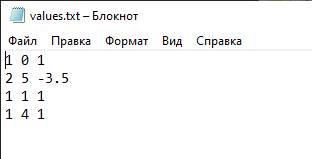
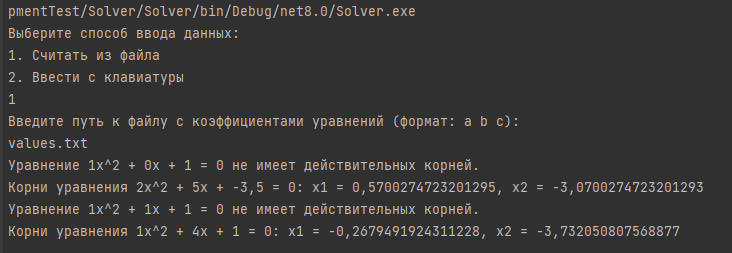
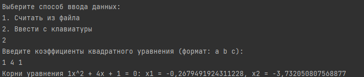
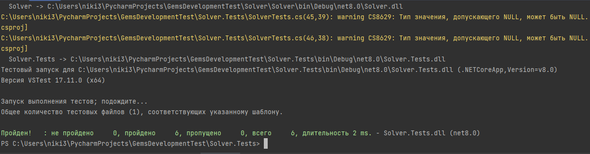

# Solver

Это консольное приложение решает квадратные уравнения вида `ax^2 + bx + c = 0`, используя ввод данных из файла или с клавиатуры.

## Варианты использования приложения

1. Результат выполнения программы с использованием файла values.txt.

2. Результат выполнения программы с использованием файла консоли.

## Тестирование

Для проверки работы приложения используются тесты, написанные с использованием фреймворка xUnit. 

Тесты на корректные входные данные:
Проверяют правильность вычисления корней для различных значений коэффициентов.

Результат выполнения тестов.

